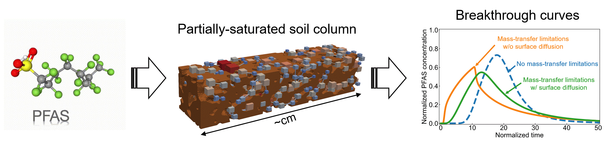

Our paper&mdash;entitled "[Pore-scale modeling of PFAS transport in water-unsaturated porous media: Air--water interfacial adsorption and mass-transfer processes in thin water films](https://agupubs.onlinelibrary.wiley.com/doi/10.1029/2023WR034664)"&mdash;is recently accepted and published on Water Resource Research (WRR) Journal. The paper presents a new pore-scale modeling framework for simulating PFAS transport in water-unsaturated porous media. Pore-scale modeling experiments highlight the importance of two unrepresented physical mechanisms including thin-water-film mass-transfer limitations and surface diffusion for PFAS transport in water-unsaturated soils. These mechanisms potentially have a significant impact on PFAS transport in the vadose zone and need to be incorporating for field-scale modeling concepts.

