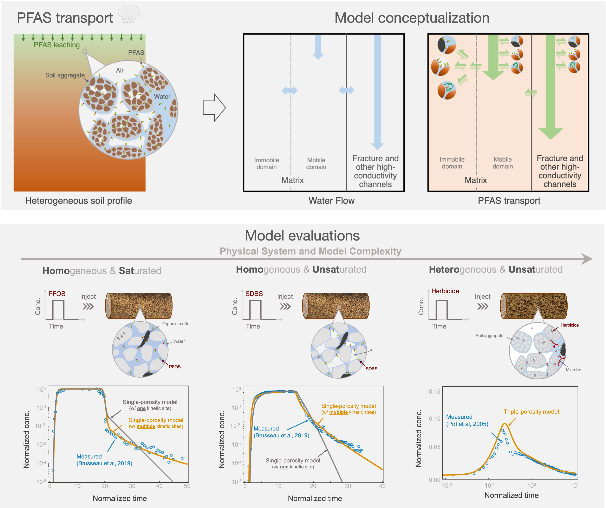

Our paper&mdash;entitled "[Semi-analytical solutions for nonequilibrium transport and transformation of PFAS and other solutes in heterogeneous vadose zones with structured porous media](https://www.sciencedirect.com/science/article/pii/S0309170825002131)"&mdash;is recently accepted for publication in the Advances in Water Resource Journal. The paper presents a group of semi-analytical models for simulating PFAS transport and transformation in heterogeneous vadose zones. The models are validated by experimentally measured breakthrough curves for varying solutes (PFAS and other nonreactive/reactive solutes), soil types, and wetting conditions. Based on numerical experiments, we also derive model simplification strategies for modeling PFAS transport and transformation in vadose zones at contamination sites. Overall, the models provide practical tools for assessing long-term fate and transport of PFAS in the vadose zone and mass discharge to groundwater.

